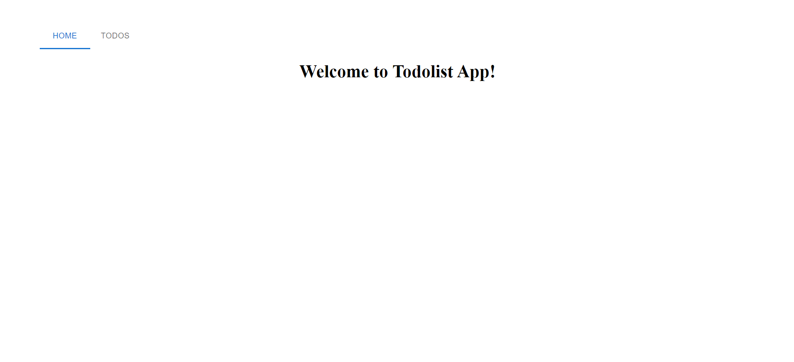
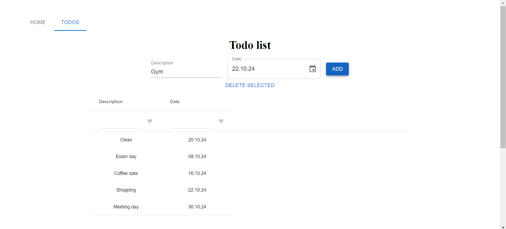
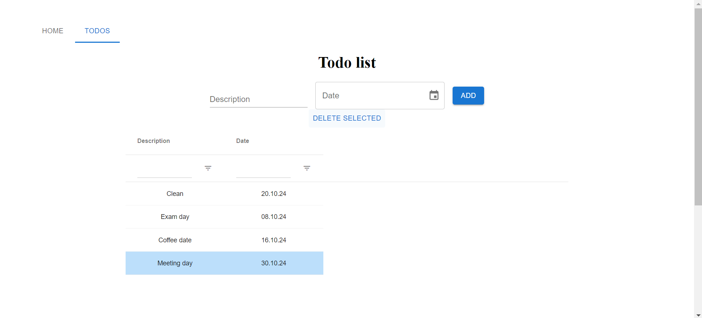

# TodoList App
This is a simple todolist app where the user can add and delete todos

## Technologies used
- JavaScript
- React
- Vite.js

## Screenshots
Home page

Todo page, where the user can write their todo, set a date to it and add it to the list

The user can delete todos by selecting them and clicking Delete Selected
